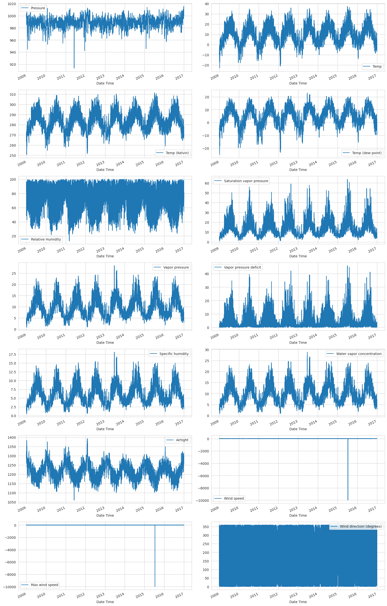

# Introduction

This tutorial explores the realm of time series forecasting with a comprehensive weather dataset provided by [Max-Planck-Institut für Biogeochemie](https://www.bgc-jena.mpg.de/wetter/) spanning various meteorological parameters like`air temperature`, `atmospheric pressure`, and `humidity`, the dataset captures readings at 10-minute intervals, commencing in 2003. Our focus will be on the subset of data from 2009 to 2016.
____________________________________________________________

Our Task is to predict the `Temperature` one day in advance, given the weather conditions for the past day. We will be using the `Temperature` column as our target variable.

# EDA

Upon looking for the `df.info()` output we get the following

```txt
    <class 'pandas.core.frame.DataFrame'>
    RangeIndex: 420551 entries, 0 to 420550
    Data columns (total 15 columns):
    #   Column           Non-Null Count   Dtype  
    ---  ------           --------------   -----  
    0   Date Time        420551 non-null  object 
    1   p (mbar)         420551 non-null  float64
    2   T (degC)         420551 non-null  float64
    3   Tpot (K)         420551 non-null  float64
    4   Tdew (degC)      420551 non-null  float64
    5   rh (%)           420551 non-null  float64
    6   VPmax (mbar)     420551 non-null  float64
    7   VPact (mbar)     420551 non-null  float64
    8   VPdef (mbar)     420551 non-null  float64
    9   sh (g/kg)        420551 non-null  float64
    10  H2OC (mmol/mol)  420551 non-null  float64
    11  rho (g/m**3)     420551 non-null  float64
    12  wv (m/s)         420551 non-null  float64
    13  max. wv (m/s)    420551 non-null  float64
    14  wd (deg)         420551 non-null  float64
    dtypes: float64(14), object(1)
    memory usage: 48.1+ MB
```

- The column names are not very intuitive and we need to rename them.
- We can see that there are no null values in the dataset.
- The `Date Time` column is of type `object` and we need to convert it to `datetime` type.
- The `Date Time` column is the index of the dataframe.

## Data Visualizations

Upon plotting the data we get the following:


- There are some noise in the dataset, we may consider resampling the data to be hourly instead of every 10 minutes.
- `Wind speed` and `Max wind speed` have an outlier, that makes the plot not very readable. We will remove it.
- `Temp (kelvin)` is the same as `Temp` but in Kelvin. We will remove it.
- `Wind Direction` is oscillating between 0 and 360 degrees.
- Being weather data, it has clear daily and yearly periodicity. So, we will add `time of day` and `month of year` as features.

## Correlations

```txt
    Temp                         1.000000
    Temp (Kelvin)                0.996827
    Saturation vapor pressure    0.951113
    Temp (dew point)             0.895708
    Vapor pressure               0.867673
    Water vapor concentration    0.867177
    Specific humidity            0.866755
    Vapor pressure deficit       0.761744
    Wind direction (degrees)     0.038732
    Max wind speed              -0.002871
    Wind speed                  -0.004689
    Pressure                    -0.045375
    Relative Humidity           -0.572416
    Airtight                    -0.963410
```

- `Temp` and `Temp (Kelvin)` are highly correlated, we will remove `Temp (Kelvin)`.
- There's nearly no correlation between `Wind speed` and `Max wind speed` and `Temp`.
- Consider creating a new feature creates a `Wind Vector` from `Wind speed` and `Wind Direction`, that might be more correlated with `Temp`.
- `Max wind speed` is highly correlated with `Wind speed`, we will remove `Max wind speed`.
