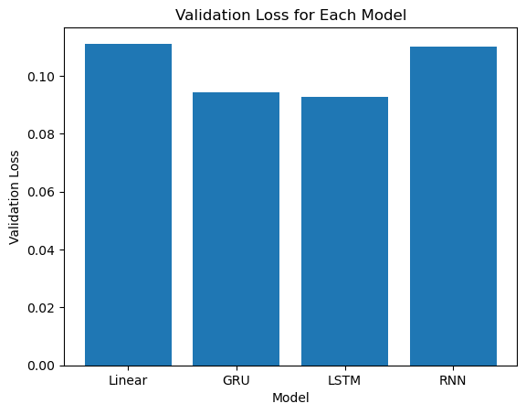

# Modeling

After preprocessing the data, we will now train a model to predict the `Temp` column.

We are focusing on building a Multi-Step Single-Shot Model. This means that we will train a model to predict the next 24 hours of weather data in one go. I find this approach more interesting than the traditional time-series forecasting approach.

After loading the datasets after preprocessing, we will create pytorch datasets for each of them, that enables the indexing of different windows of the data.

## Shortlist promising models

1. Linear Regression
    We will be considered as a baseline model, and then we will try more complex models. Which scored an `MSE` of $0.111$ on the validation set.

    ```python
    class LinearRegressionModel(nn.Module):
    def __init__(self, input_dim, output_dim):
        super(LinearRegressionModel, self).__init__()
        self.linear = nn.Linear(input_dim, output_dim)

    def forward(self, x):
        out = self.linear(x)
        out = out[:, -1, :]
        return out
    ```

2. GRU Model
    We will use a GRU model with 2 layers. Which scored an `MSE` of $0.09$ on the validation set.

    ```python
    class GRUModel(nn.Module):
        def __init__(self, input_size, hidden_size, num_layers, output_size):
            super(GRUModel, self).__init__()
            self.hidden_size = hidden_size
            self.num_layers = num_layers
            self.gru = nn.GRU(input_size, hidden_size, num_layers, batch_first=True)
            self.fc = nn.Linear(hidden_size, output_size)

        def forward(self, x):
            h0 = torch.zeros(self.num_layers, x.size(0), self.hidden_size).to(x.device)
            out, _ = self.gru(x, h0)
            out = self.fc(out[:, -1, :])
            return out
    ```

3. LSTM Model
    We will use a LSTM model with 2 layers. Which scored an `MSE` of $0.08$ on the validation set.

    ```python
    class LSTMModel(nn.Module):
        def __init__(self, input_dim, hidden_dim, layer_dim, output_dim):
            super(LSTMModel, self).__init__()
            self.hidden_dim = hidden_dim
            self.layer_dim = layer_dim
            self.lstm = nn.LSTM(input_dim, hidden_dim, layer_dim, batch_first=True)
            self.fc = nn.Linear(hidden_dim, output_dim)

        def forward(self, x):
            h0 = torch.zeros(self.layer_dim, x.size(0), self.hidden_dim).to(x.device)
            c0 = torch.zeros(self.layer_dim, x.size(0), self.hidden_dim).to(x.device)

            out, _ = self.lstm(x, (h0, c0))

            out = self.fc(out[:, -1, :])
            return out
    ```

4. RNN Model
    We will use a RNN model. Which scored an `MSE` of $0.125$ on the validation set.

    ```python
    class RNNModel(nn.Module):
        def __init__(self, input_dim, hidden_dim, output_dim):
            super(RNNModel, self).__init__()
            self.hidden_dim = hidden_dim
            self.rnn = nn.RNN(input_dim, hidden_dim, batch_first=True)
            self.fc = nn.Linear(hidden_dim, output_dim)

        def forward(self, x):
            h0 = torch.zeros(1, x.size(0), self.hidden_dim).to(x.device)
            out, _ = self.rnn(x, h0)
            out = self.fc(out[:, -1, :])
            return out
    ```

## Compare models

By comparing the models using the `MSE` metric on the validation set, we found out that the LSTM model is the best model.



## Hyperparameter tuning

using the `optuna` library, we will tune the hyperparameters of the LSTM model, and optimizer to get the best model possible.

The hyperparameters that we will tune are:

- `hidden_dim`: The number of features in the hidden state $h$.
- `layer_dim`: Number of recurrent layers.
- `learning_rate`: Learning rate of the optimizer.
- `num_epochs`: Number of epochs to train the model.
- `batch_size`: Number of samples in a batch.

The results of the hyperparameter tuning are:

- `hidden_dim`: 32
- `layer_dim`: 2
- `learning_rate`: 0.0003419217207809318
- `num_epochs`: 20
- `batch_size`: 32

Which scored an `MSE` of $0.077$ on the validation set, and $0.07$ on the test set.