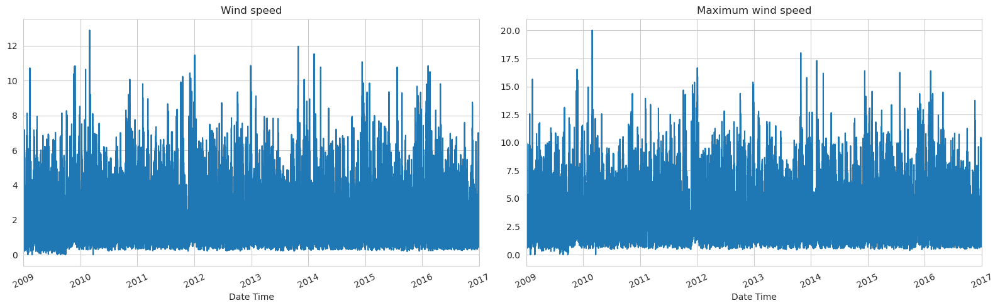
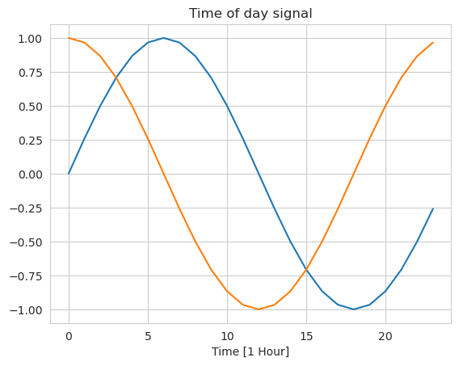
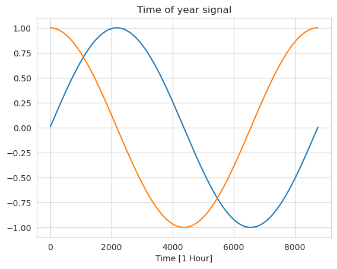
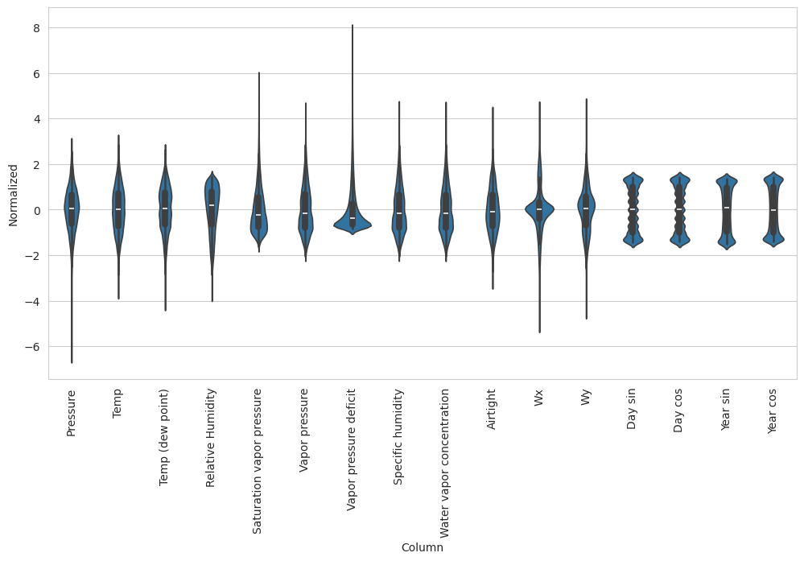

# Data Preprocessing

After the initial data exploration, we will now preprocess the data to make it ready for training.

## Data Cleaning

1. We will resample the data to be hourly instead of every 10 minutes.

    ```python
    df_copy = df_copy.resample("H").mean().interpolate()
    ```

2. We will remove the outlier in `Wind speed` and `Max wind speed`.

    ```python
    df_copy = df_copy[df_copy["Max wind speed"] < -100]
    ```

    
3. Remove the `Temp (Kelvin)` column.

    ```python
    df_copy.drop("Temp (Kelvin)", axis=1, inplace=True)
    ```

4. Remove the `Max wind speed` column.

    ```python
    df_copy.drop("Max wind speed", axis=1, inplace=True)
    ```

## Feature Engineering

### Wind Vector

Combine the `Wind speed` and `Wind direction` columns to get the `Wind vector` column.

```python
# Convert to radians
wd_rad = df_copy.pop("Wind direction (degrees)") * np.pi / 180

# Calculate the wind x and y components
df_copy["Wx"] = wv *np.cos(wd_rad)
df_copy["Wy"] = wv* np.sin(wd_rad)
```

And we found out that it does correlate with the `Temp` column, more than the `Wind speed` and `Wind direction` separately.

### Seasonality

As the data is weather data, it has clear daily and yearly periodicity. So, we will add `time of day` and `month of year` as features.

```python
# day and year in seconds
day = 24 * 60 * 60
year = (365.2425) * day

df_copy["Day sin"] = np.sin(df_copy.index.astype(np.int64) // 1e9 * (np.pi * 2 / day))
df_copy["Day cos"] = np.cos(df_copy.index.astype(np.int64) // 1e9 * (np.pi * 2 / day))
df_copy["Year sin"] = np.sin(df_copy.index.astype(np.int64) // 1e9 * (np.pi * 2 / year))
df_copy["Year cos"] = np.cos(df_copy.index.astype(np.int64) // 1e9 * (np.pi * 2 / year))
```

 

And there's no surprise that it does correlate with the `Temp` column.

## Splitting the data

The last step is to split the data into training, validation and test sets. with a ratio of 70%, 15%, and 15% respectively.

As it's a time series data, we will not shuffle the data.

```python
train_size = int(0.7 * len(df_copy))
val_size = int(0.15 * len(df_copy))
test_size = int(0.15 * len(df_copy))

# Split the data into train 70%, validation 15%, and test 15%
train_df = df_copy.iloc[:train_size]
val_df = df_copy.iloc[train_size : train_size + val_size]
test_df = df_copy.iloc[train_size + val_size :]
```

## Normalization

The last step before saving the dataset for modeling is to normalize the data. We will use the `StandardScaler` from `sklearn`.

```python
sc = StandardScaler()
train_scaled = sc.fit_transform(train_df)

# Use the same scaler to transform the validation and test sets
val_scaled = sc.transform(val_df)
test_scaled = sc.transform(test_df)
```


